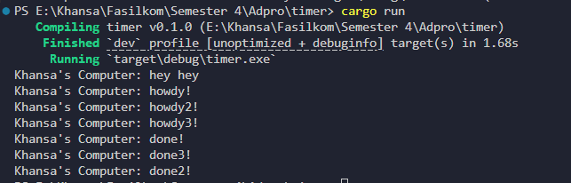
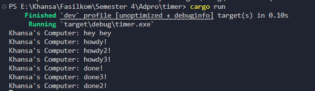

# Module 10 Tutorial: Asynchronous Programming

Advanced Programming (Even Semester 2024/2025) Tutorial Module 10

Khansa Khairunisa - 2306152462

## Reflection

### 1.2: Understanding how it works

Pada output program, terlihat bahwa pesan Khansa's Computer: outside spawn muncul terlebih dahulu, disusul oleh Khansa's Computer: howdy! dan kemudian Khansa's Computer: done! setelah jeda dua detik. Hal ini terjadi karena howdy! dan done! merupakan bagian dari blok async yang hanya akan dieksekusi saat executor.run() dipanggil, sementara baris outside spawn berada di luar blok async dan langsung dieksekusi setelah spawner.spawn(...) dan sebelum executor dijalankan. Ketika saya menambahkan println!("Khansa's Computer: hey hey") setelah pemanggilan spawner.spawn(...), hasil output menunjukkan bahwa pesan tersebut muncul lebih awal dibanding howdy! dan done!, karena hey hey juga berada di luar blok async sehingga langsung dijalankan tanpa menunggu executor. Urutan ini menggambarkan perbedaan antara eksekusi sinkron dan asynchronous dalam sistem executor Rust.

### 1.3: Multiple Spawn and removing drop

Ketika drop(spawner) dinyalakan, executor akan mengetahui bahwa tidak ada lagi task baru yang akan dikirim ke dalam antrean. Setelah menjalankan semua task asynchronous yang telah di-spawn, executor akan berhenti secara normal. Dalam kasus ini, output seperti Khansa's Computer: hey hey akan muncul terlebih dahulu karena berada di luar blok async, lalu diikuti oleh howdy!, howdy2!, dan howdy3! yang berjalan secara asynchronous. Ketiga task tersebut akan dimulai hampir bersamaan, dan output done, done2, dan done3 akan muncul setelah delay 2 detik—dengan urutan yang mungkin berbeda tergantung eksekusi internal dan scheduler. Program pun akan selesai secara otomatis setelah semua task selesai karena executor telah mendapat sinyal bahwa tidak ada task tambahan.

Sebaliknya, ketika drop(spawner) dimatikan atau dijadikan komentar, executor tidak pernah mendapatkan informasi bahwa semua task telah selesai di-spawn. Akibatnya, meskipun semua task telah dijalankan dan output sudah muncul, executor akan tetap menunggu task baru yang tidak pernah datang. Ini menyebabkan program tidak selesai dan terus berjalan tanpa henti. Hal ini terjadi karena executor mengandalkan sinyal drop(spawner) untuk mengetahui bahwa sumber task telah habis. Tanpa sinyal ini, executor tetap dalam kondisi siaga, membuat program seolah "macet" meski seluruh logika asynchronous sebenarnya telah dijalankan dengan benar.