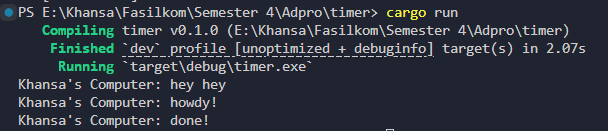

# Module 10 Tutorial: Asynchronous Programming

Advanced Programming (Even Semester 2024/2025) Tutorial Module 10

Khansa Khairunisa - 2306152462

## Reflection

### 1.2: Understanding how it works

Pada output program, terlihat bahwa pesan Khansa's Computer: outside spawn muncul terlebih dahulu, disusul oleh Khansa's Computer: howdy! dan kemudian Khansa's Computer: done! setelah jeda dua detik. Hal ini terjadi karena howdy! dan done! merupakan bagian dari blok async yang hanya akan dieksekusi saat executor.run() dipanggil, sementara baris outside spawn berada di luar blok async dan langsung dieksekusi setelah spawner.spawn(...) dan sebelum executor dijalankan. Ketika saya menambahkan println!("Khansa's Computer: hey hey") setelah pemanggilan spawner.spawn(...), hasil output menunjukkan bahwa pesan tersebut muncul lebih awal dibanding howdy! dan done!, karena hey hey juga berada di luar blok async sehingga langsung dijalankan tanpa menunggu executor. Urutan ini menggambarkan perbedaan antara eksekusi sinkron dan asynchronous dalam sistem executor Rust.

